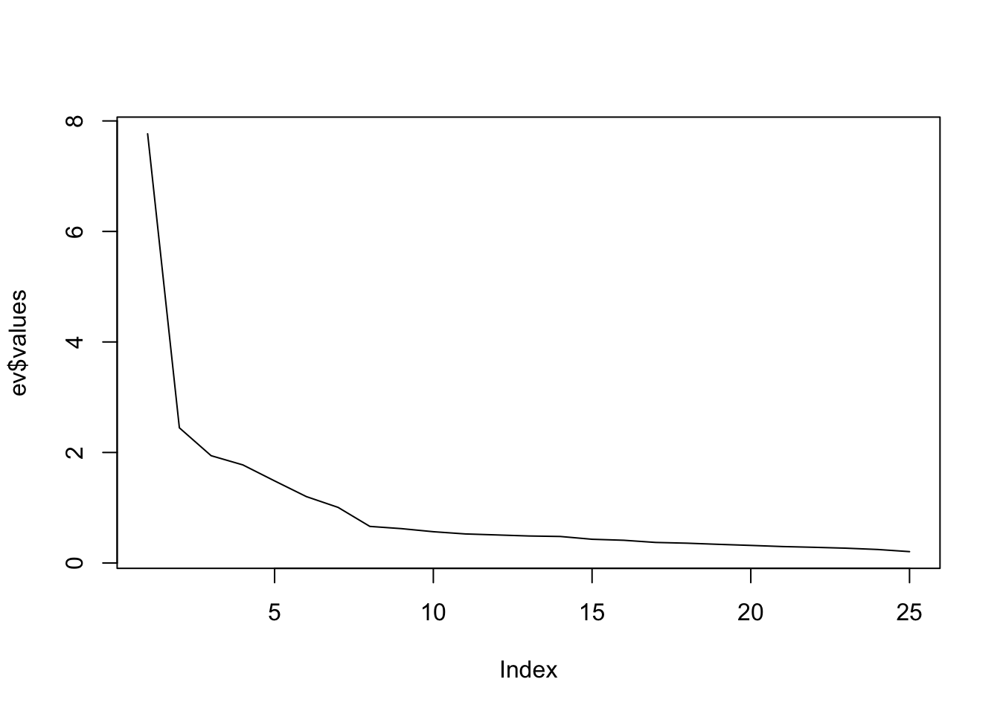

```r
library(readxl)
library(lavaan)
```

```
## This is lavaan 0.6-17
## lavaan is FREE software! Please report any bugs.
```

```r
library(foreign)
data <- read_excel("Dataset.xlsx")
```

# Data preprocessing


```r
levels = c("Totally disagree", "Disagree", "More or less disagree", "Neutral", "More or less agree", "Agree","Totally agree")
df <- data.frame(lapply(data[,2:26], function(x) as.integer(factor(x, levels = levels))))
```

# Investigate correlations


```r
cormatrix <- cor(df)
round(cormatrix, 2)
```

```
##       Q1   Q2   Q3   Q4   Q5    Q6   Q7   Q8   Q9   Q10   Q11   Q12  Q13  Q14
## Q1  1.00 0.70 0.57 0.55 0.31  0.31 0.38 0.32 0.33  0.11  0.17  0.17 0.35 0.31
## Q2  0.70 1.00 0.65 0.52 0.33  0.29 0.29 0.29 0.37  0.10  0.15  0.14 0.37 0.32
## Q3  0.57 0.65 1.00 0.65 0.31  0.35 0.31 0.31 0.38  0.12  0.11  0.09 0.34 0.39
## Q4  0.55 0.52 0.65 1.00 0.33  0.38 0.31 0.27 0.39  0.05  0.11  0.04 0.30 0.34
## Q5  0.31 0.33 0.31 0.33 1.00  0.68 0.55 0.48 0.54  0.01  0.01  0.01 0.35 0.34
## Q6  0.31 0.29 0.35 0.38 0.68  1.00 0.61 0.48 0.48 -0.01  0.04  0.04 0.32 0.36
## Q7  0.38 0.29 0.31 0.31 0.55  0.61 1.00 0.54 0.56  0.01  0.12  0.08 0.36 0.34
## Q8  0.32 0.29 0.31 0.27 0.48  0.48 0.54 1.00 0.47  0.09  0.08  0.06 0.34 0.35
## Q9  0.33 0.37 0.38 0.39 0.54  0.48 0.56 0.47 1.00  0.07  0.09  0.09 0.38 0.36
## Q10 0.11 0.10 0.12 0.05 0.01 -0.01 0.01 0.09 0.07  1.00  0.67  0.66 0.10 0.08
## Q11 0.17 0.15 0.11 0.11 0.01  0.04 0.12 0.08 0.09  0.67  1.00  0.64 0.09 0.06
## Q12 0.17 0.14 0.09 0.04 0.01  0.04 0.08 0.06 0.09  0.66  0.64  1.00 0.09 0.03
## Q13 0.35 0.37 0.34 0.30 0.35  0.32 0.36 0.34 0.38  0.10  0.09  0.09 1.00 0.62
## Q14 0.31 0.32 0.39 0.34 0.34  0.36 0.34 0.35 0.36  0.08  0.06  0.03 0.62 1.00
## Q15 0.34 0.33 0.34 0.34 0.36  0.32 0.33 0.34 0.44  0.10  0.07  0.07 0.53 0.59
## Q16 0.17 0.18 0.19 0.12 0.11  0.14 0.11 0.20 0.16 -0.02  0.06 -0.01 0.09 0.09
## Q17 0.20 0.21 0.15 0.16 0.14  0.18 0.18 0.24 0.11  0.03  0.10  0.02 0.14 0.13
## Q18 0.11 0.16 0.09 0.09 0.13  0.13 0.07 0.17 0.11 -0.04  0.03 -0.04 0.16 0.08
## Q19 0.27 0.34 0.32 0.33 0.30  0.30 0.28 0.25 0.27  0.01 -0.05 -0.07 0.32 0.28
## Q20 0.22 0.22 0.21 0.20 0.24  0.29 0.27 0.19 0.26 -0.01 -0.05 -0.03 0.24 0.22
## Q21 0.12 0.21 0.23 0.20 0.12  0.18 0.20 0.14 0.18  0.01 -0.06 -0.02 0.23 0.22
## Q22 0.35 0.35 0.37 0.33 0.34  0.43 0.36 0.31 0.34  0.18  0.16  0.18 0.38 0.36
## Q23 0.37 0.35 0.36 0.31 0.27  0.40 0.31 0.30 0.32  0.09  0.04  0.11 0.30 0.28
## Q24 0.39 0.38 0.38 0.35 0.29  0.36 0.31 0.24 0.40  0.19  0.11  0.22 0.32 0.34
## Q25 0.37 0.37 0.44 0.42 0.36  0.42 0.30 0.29 0.44  0.16  0.13  0.19 0.32 0.38
##      Q15   Q16  Q17   Q18   Q19   Q20   Q21  Q22  Q23  Q24  Q25
## Q1  0.34  0.17 0.20  0.11  0.27  0.22  0.12 0.35 0.37 0.39 0.37
## Q2  0.33  0.18 0.21  0.16  0.34  0.22  0.21 0.35 0.35 0.38 0.37
## Q3  0.34  0.19 0.15  0.09  0.32  0.21  0.23 0.37 0.36 0.38 0.44
## Q4  0.34  0.12 0.16  0.09  0.33  0.20  0.20 0.33 0.31 0.35 0.42
## Q5  0.36  0.11 0.14  0.13  0.30  0.24  0.12 0.34 0.27 0.29 0.36
## Q6  0.32  0.14 0.18  0.13  0.30  0.29  0.18 0.43 0.40 0.36 0.42
## Q7  0.33  0.11 0.18  0.07  0.28  0.27  0.20 0.36 0.31 0.31 0.30
## Q8  0.34  0.20 0.24  0.17  0.25  0.19  0.14 0.31 0.30 0.24 0.29
## Q9  0.44  0.16 0.11  0.11  0.27  0.26  0.18 0.34 0.32 0.40 0.44
## Q10 0.10 -0.02 0.03 -0.04  0.01 -0.01  0.01 0.18 0.09 0.19 0.16
## Q11 0.07  0.06 0.10  0.03 -0.05 -0.05 -0.06 0.16 0.04 0.11 0.13
## Q12 0.07 -0.01 0.02 -0.04 -0.07 -0.03 -0.02 0.18 0.11 0.22 0.19
## Q13 0.53  0.09 0.14  0.16  0.32  0.24  0.23 0.38 0.30 0.32 0.32
## Q14 0.59  0.09 0.13  0.08  0.28  0.22  0.22 0.36 0.28 0.34 0.38
## Q15 1.00  0.13 0.09  0.12  0.24  0.24  0.27 0.34 0.30 0.30 0.39
## Q16 0.13  1.00 0.55  0.55  0.20  0.16  0.13 0.15 0.11 0.09 0.13
## Q17 0.09  0.55 1.00  0.53  0.23  0.17  0.14 0.13 0.15 0.12 0.13
## Q18 0.12  0.55 0.53  1.00  0.18  0.11  0.18 0.15 0.16 0.06 0.12
## Q19 0.24  0.20 0.23  0.18  1.00  0.65  0.51 0.29 0.37 0.31 0.39
## Q20 0.24  0.16 0.17  0.11  0.65  1.00  0.56 0.30 0.39 0.29 0.37
## Q21 0.27  0.13 0.14  0.18  0.51  0.56  1.00 0.33 0.45 0.38 0.38
## Q22 0.34  0.15 0.13  0.15  0.29  0.30  0.33 1.00 0.50 0.58 0.56
## Q23 0.30  0.11 0.15  0.16  0.37  0.39  0.45 0.50 1.00 0.55 0.55
## Q24 0.30  0.09 0.12  0.06  0.31  0.29  0.38 0.58 0.55 1.00 0.61
## Q25 0.39  0.13 0.13  0.12  0.39  0.37  0.38 0.56 0.55 0.61 1.00
```


```r
# Bartlett Sphericity Test. The null hypothesis is that the data dimension reduction is not possible. 
# If p-value < 0.05, we reject the null hypothesis and apply FA. This test is sensitive to N.
library(psych)
```

```
## 
## Attaching package: 'psych'
```

```
## The following object is masked from 'package:lavaan':
## 
##     cor2cov
```

```r
print(cortest.bartlett(cor(df), nrow(df)))
```

```
## $chisq
## [1] 4288.946
## 
## $p.value
## [1] 0
## 
## $df
## [1] 300
```

```r
# Kaiser-Meyer-Oklin Test (KMO). MSO overall should be .60 or higher to proceed with factor analysis
KMO(df)
```

```
## Kaiser-Meyer-Olkin factor adequacy
## Call: KMO(r = df)
## Overall MSA =  0.88
## MSA for each item = 
##   Q1   Q2   Q3   Q4   Q5   Q6   Q7   Q8   Q9  Q10  Q11  Q12  Q13  Q14  Q15  Q16 
## 0.87 0.87 0.90 0.90 0.90 0.89 0.88 0.94 0.91 0.70 0.73 0.77 0.90 0.89 0.91 0.76 
##  Q17  Q18  Q19  Q20  Q21  Q22  Q23  Q24  Q25 
## 0.80 0.74 0.87 0.84 0.86 0.94 0.93 0.91 0.94
```

```r
# Calculate eigenvalues
library(nFactors)
```

```
## Loading required package: lattice
```

```
## 
## Attaching package: 'nFactors'
```

```
## The following object is masked from 'package:lattice':
## 
##     parallel
```

```r
ev <- eigen(cor(df))
ev$values
```

```
##  [1] 7.7669762 2.4465692 1.9418982 1.7750782 1.4854633 1.2016330 1.0062228
##  [8] 0.6621808 0.6213983 0.5659363 0.5260439 0.5075505 0.4888379 0.4797451
## [15] 0.4293662 0.4111386 0.3718663 0.3581355 0.3371443 0.3180569 0.2974175
## [22] 0.2837698 0.2679006 0.2442166 0.2054541
```

```r
# The first 7 factors have an eigenvalue >1
plot(ev$values, type="line")   
```

```
## Warning in plot.xy(xy, type, ...): plot type 'line' will be truncated to first
## character
```



```r
# Get factors and loadings
fit = factanal(~ ., factors = 7, data = df, lower=0.1, rotation = "varimax")
print(fit)
```

```
## 
## Call:
## factanal(x = ~., factors = 7, data = df, rotation = "varimax",     lower = 0.1)
## 
## Uniquenesses:
##    Q1    Q2    Q3    Q4    Q5    Q6    Q7    Q8    Q9   Q10   Q11   Q12   Q13 
## 0.363 0.293 0.382 0.495 0.377 0.327 0.416 0.563 0.519 0.302 0.321 0.359 0.435 
##   Q14   Q15   Q16   Q17   Q18   Q19   Q20   Q21   Q22   Q23   Q24   Q25 
## 0.319 0.482 0.442 0.468 0.438 0.358 0.318 0.471 0.467 0.473 0.358 0.399 
## 
## Loadings:
##     Factor1 Factor2 Factor3 Factor4 Factor5 Factor6 Factor7
## Q1   0.216   0.721   0.166   0.112           0.128         
## Q2   0.157   0.774   0.151           0.121   0.150   0.127 
## Q3   0.193   0.693   0.211           0.104   0.195         
## Q4   0.243   0.608   0.192           0.105   0.161         
## Q5   0.739   0.164   0.123                   0.159         
## Q6   0.747   0.141   0.258           0.104   0.104         
## Q7   0.707   0.171   0.111           0.128   0.146         
## Q8   0.565   0.164                           0.211   0.176 
## Q9   0.555   0.236   0.219                   0.235         
## Q10                          0.826                         
## Q11                          0.812                         
## Q12                  0.153   0.780                         
## Q13  0.245   0.211   0.135           0.142   0.643         
## Q14  0.239   0.185   0.168                   0.742         
## Q15  0.251   0.192   0.183           0.114   0.606         
## Q16                                                  0.732 
## Q17  0.119   0.109                   0.106           0.701 
## Q18                                                  0.738 
## Q19  0.183   0.220   0.130           0.708   0.132   0.147 
## Q20  0.177           0.172           0.776                 
## Q21                  0.361           0.604   0.133   0.106 
## Q22  0.276   0.178   0.579   0.137   0.145   0.205         
## Q23  0.203   0.211   0.584           0.288   0.100         
## Q24  0.178   0.245   0.699   0.132   0.155   0.142         
## Q25  0.241   0.246   0.612   0.113   0.237   0.192         
## 
##                Factor1 Factor2 Factor3 Factor4 Factor5 Factor6 Factor7
## SS loadings      2.878   2.532   2.116   2.048   1.811   1.753   1.719
## Proportion Var   0.115   0.101   0.085   0.082   0.072   0.070   0.069
## Cumulative Var   0.115   0.216   0.301   0.383   0.455   0.525   0.594
## 
## Test of the hypothesis that 7 factors are sufficient.
## The chi square statistic is 253.88 on 146 degrees of freedom.
## The p-value is 7.89e-08
```

