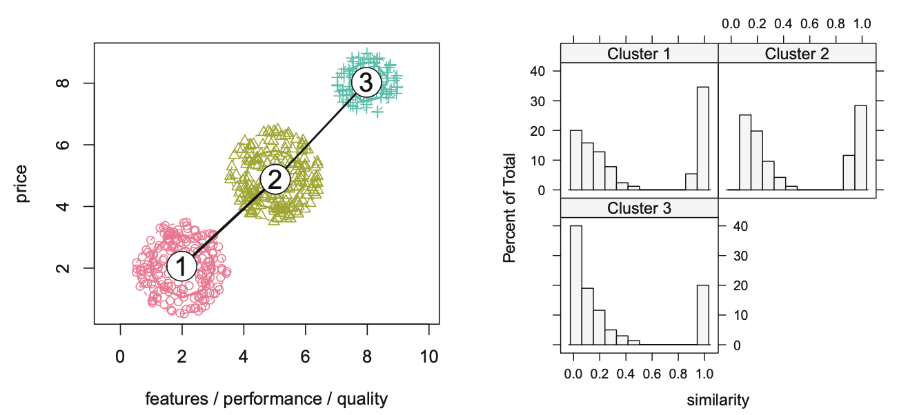

# Cluster Analysis

## Hierarchical and non-hierarchical cluster analysis.
Key lessons from hierarchical and non-hierarchical cluster analysis:
  ▶ There is substantial ambiguity associated with:
    ▶ The number of clusters
    ▶ The measurement of proximity of individuals
    ▶ The measurement of proximity of groups
  ▶ There is no single index to compare different cluster solutions
  ▶ Existing validation techniques depend on data and/or the cluster algorithm

Background: Hierarchical and non-hierarchical cluster analysis
  ▶ Both of the classic methods for doing cluster analysis are based on combinatorial methods using heuristic         procedures
    ▶ No assumptions about the class structure are made regarding the population
    ▶ Choice of clustering method and proximity measure is based on posterior
      criteria like interpretability of the results
    
### Packages and data.
```{r setup, include=FALSE}
knitr::opts_chunk$set(echo = TRUE)
# R script for the analysis of the HBAT example in the cluster analysis lecture
library(readstata13)
library(NbClust)
rm(list=ls())

HBAT <- read.dta13("Data/hbat.dta")
```

### Data Preparation

- Pick variables
- Summarize and inspect data
- Outlier detection
- Add ID row

```{r}
# first we make our own id variable based on the original order
nobs <- nrow(HBAT)
HBAT$id <- seq(1,nobs)

# pick the variables for cluster analysis and summarize them
hbat <- c("x6","x8","x12","x15","x18")
summary(HBAT[,hbat])
apply(HBAT[,hbat],2,sd) # Get standard deviation of the variables

# multicollinearity should not be a problem
cor(HBAT[,hbat])
# which is confirmed

# look for outliers
dev <- t(t(HBAT[,hbat])-apply(HBAT[,hbat],2,mean))
dev2 <- dev^2
sumdev2 <- rowSums(dev2)
sort(sqrt(sumdev2))
# observations 6 and 87 are candidates for deletion

#Remove the observations and give new IDs
HBAT <- subset(HBAT,id!="6"&id!="87")
nobs <- nrow(HBAT)
HBAT$id <- seq(1,nobs)
```

### Hierarchical clustering

Hierarchical clustering relies on distance measures. We have covered two types:
- Euclidian distance (shortest line to connect two dots)
- Manhattan distance (mimics traveling across roads)

We distinguish between two types of hierarchical methods:
- Agglomerative: Objects start as their own cluster and are succesively joined until they are all connected
- Divisive: Objects start in a single cluster and objects are succesively divided (rarely used)

We can choose between different methods for linking two objects in the agglomerative method:

- Single-linkage: Distance between two clusters is measured as the minimum distance between all pairs
  - Finds unbalanced / straggly clusters
  
- Complete-linkage: Distance measured as the maximum distance between all pairs
  - Finds compact clusters with equal diameters
  
- Average-linkage: Distance measured as the average distance between all pairs

- Centroid-linkage: Calculate the average object (centroid) per cluster and use those for distance measures

- Ward's method: Minimize the within-cluster sum-of-squares

```{r}
# First, create a distance matrix using the Euclidean method for selected columns identified by 'hbat'.
dist <- dist(HBAT[,hbat], method="euclidean")
# Square the distance matrix - a common step before applying Ward's method to ensure that the algorithm focuses on variance minimization.
dist2 <- dist^2
```

#### Perform hierarchical clustering using Ward's method

- Use Ward's method to obtain clusters
- The algo continues until all observations are joined (i.e. forming one single cluster)
- We need to determine the optimal number of clusters
- One method: Use dendogram and look for the point where dissimilar clusters are joined

```{r}
## Perform hierarchical clustering using Ward's method, which minimizes the total within-cluster variance at each step.
H.fit <- hclust(dist2, method="ward.D")

# Plot the dendrogram to visualize the clustering hierarchy.
plot(H.fit)

# After inspecting the dendrogram, we determine that the data seems best divided into three or possibly four clusters.

# Calculate the percentage increase in height at each cluster merge to help determine the optimal number of clusters.
# This helps identify significant jumps in dissimilarity (height), suggesting a natural cluster grouping.
denominator <- cumsum(H.fit[[2]])  # Cumulative sum of heights at which clusters are merged.
length(denominator) <- nobs-2  # Adjust length of vector to match the number of observations minus 2.
denominator <- c(1, denominator)  # Prepend 1 to the beginning of the vector to handle division for the first element.
pct <- H.fit[[2]] / denominator  # Calculate percent increases for each merge.
tail(pct, n=10)  # Display the last 10 percentage increases to inspect the largest changes at the end of the clustering process.

# The decision to stop clustering is made just before a significant increase in the percentage increase of height, indicating a natural cluster boundary.
# From the analysis, apart from going from 2 to 1 cluster (0.22598688), the largest jump in percent increase is observed when reducing from 4 to 3 clusters (0.15224902).
# The last large merge happening from 2 clusters to 1 is typically indicative of forcing too broad a grouping.

# Cut the dendrogram tree into 4 clusters based on the observed hierarchical structure.
grp <- as.factor(cutree(H.fit, k=4))

# Display a table showing the number of observations in each of the 4 identified clusters.
# This helps to understand the distribution of data points across the clusters.
table(grp)
# Observing the distribution can provide insights into how balanced or imbalanced the clusters are, and whether the division into clusters makes practical sense based on the domain knowledge.


# Illustrate a 4-cluster solution by adding rectangles to the dendrogram plot to highlight the clusters.
plot(H.fit)
rect.hclust(H.fit, k=4, border="red")

# Assess the outcome by computing the mean of selected columns for each cluster. This helps to understand the central tendency of each cluster.
aggregate(HBAT[,hbat], list(grp), mean)

# Perform ANOVA (Analysis of Variance) to assess if there are statistically significant differences among the means of the clusters for different variables.
summary(aov(x6 ~ grp, data=HBAT))  # Analyze variable x6
summary(aov(x8 ~ grp, data=HBAT))  # Analyze variable x8
summary(aov(x12 ~ grp, data=HBAT)) # Analyze variable x12
summary(aov(x15 ~ grp, data=HBAT)) # Analyze variable x15
summary(aov(x18 ~ grp, data=HBAT)) # Analyze variable x18
# All variables are significantly different
```

#### Switch to complete linkage method

- Use complete linkage method
- Use dendogram method as previously
- Compare methods

```{r}
## Switch to complete linkage method for hierarchical clustering using the original distance matrix.
H.fit <- hclust(dist, method="complete")

# Draw a dendrogram to visualize the clustering with complete linkage.
plot(H.fit)

# Assess the percentage increase in merging heights, similar to previous steps, to evaluate the cluster merges.
denominator <- cumsum(H.fit[[2]])
length(denominator) <- nobs-2
denominator <- c(1, denominator)
pct <- H.fit[[2]] / denominator
tail(pct, n=10)  # Display the last 10 percentage increases.
# Biggest jump is from 3 to 2 clusters besides 2 to 1.

# Results from Ward's method are validated with complete linkage, noting differences in clustering.
grp <- as.factor(cutree(H.fit, k=4))
table(grp)  # Display the distribution of data points in the clusters.
```
#### Optimal number of clusters

- Use NbClust() to search for optimal number of clusters
- min.nc and max.nc determines search range

```{r}
# Use NbClust to determine the optimal number of clusters using a variety of indices and Ward's method.
res <- NbClust(HBAT[,hbat], distance = "euclidean", min.nc=2, max.nc=8, 
               method = "ward.D", index = "all")
# Maybe ignore plots

# Display all indices computed by NbClust and the recommended number of clusters. Interpretation???
# res$All.index
# res$Best.nc

# Note: This conclusion is statistical and does not necessarily reflect the practical significance or domain-specific context of the data.
```
#### Plot solution

- Plot dendograms together with final cluster choice
- Aggregate variables based on group membership and look for differences
- Check if group membership significantly predicts variables

```{r}
# Illustrate the 4-cluster solution with complete linkage, highlighting the clusters on the dendrogram.
plot(H.fit)
rect.hclust(H.fit, k=4, border="red")

# Assess the outcome by computing the mean for each cluster with the new method.
aggregate(HBAT[,hbat], list(grp), mean)

# Repeat ANOVA to compare cluster means for several variables using the new cluster assignments.
summary(aov(x6 ~ grp, data=HBAT))
summary(aov(x8 ~ grp, data=HBAT))
summary(aov(x12 ~ grp, data=HBAT))
summary(aov(x15 ~ grp, data=HBAT))
summary(aov(x18 ~ grp, data=HBAT))
# All variables are significant
```
#### Toy example

- Perform hierarchical clustering using different linkage methods

```{r}
# Define income and education data for a toy dataset
inc <- c(5, 6, 15, 16, 25, 30)
edu <- c(5, 6, 14, 15, 20, 19)
toy <- data.frame(inc, edu)

# Calculate Euclidean distance between points
toy.dist <- dist(toy, method="euclidean")

# Square the distances for use in clustering algorithms that minimize variance
toy.dist2 <- toy.dist^2

# Perform hierarchical clustering using single linkage
toy.H.single <- hclust(toy.dist2, method="single")

# Output the merging sequence of clusters
toy.H.single$merge

# Output increases in distance at each merge point
toy.H.single$height

# Permutation of original observations suitable for plotting
toy.H.single$order

# Plot the dendrogram
plot(toy.H.single)

# Explore other linkage methods for comparison
toy.H.complete <- hclust(toy.dist, method="complete")
toy.H.average <- hclust(toy.dist, method="average")
toy.H.centroid <- hclust(toy.dist, method="centroid")

# Perform hierarchical clustering using Ward's method
toy.H.ward <- hclust(toy.dist2, method="ward.D")
```

### Nonhierarchical Clustering

Non-hierarchical clustering techniques are characterized by wanting to do two things:
- Maximise intra-class similarity
- Minimize inter-class similarity

Two key differences between hierarchical and non-hierarchical clustering:
1) In non-h we must know number of clusters (k) a priori
2) In non-h once an object is assigned a cluster it can be reassigned later

#### K-means clustering

Could look like this:

1) Choose number of clusters, k
2) Initialize k (sometimes randomly chosen) centroids / prototypes
3) Assign all objects to closest centroid
4) Calculate new centroids
5) Assign all objects to closest centroid
6) Calculate new centroids
Repeat until convergence

Algorithms differ in how the initial centroids are chosen, and if objects are assigned to a random centroid initially.

```{r}
# Set a random seed to ensure reproducibility of the k-means clustering results
set.seed(4118)

# Perform k-means clustering on selected columns with 4 clusters and 25 random starts to ensure convergence to a good solution
NH.fit <- kmeans(HBAT[,hbat], 4, nstart=25)

# Print the results of the k-means clustering to see the cluster centers and size
print(NH.fit)

# Extract the cluster assignments for each observation and convert it into a factor
grp <- as.factor(NH.fit[[1]])

# Display a table to see the number of observations in each cluster
table(grp)

# Assess the outcome by computing the mean of selected variables for each cluster
aggregate(HBAT[,hbat], list(grp), mean)

# Perform ANOVA to assess if there are significant differences among clusters for various variables
summary(aov(x6 ~ grp, data=HBAT))
summary(aov(x8 ~ grp, data=HBAT))
summary(aov(x12 ~ grp, data=HBAT))
summary(aov(x15 ~ grp, data=HBAT))
summary(aov(x18 ~ grp, data=HBAT))
# x18 is not significantly different

# Create a snake plot to visualize the profiles of cluster centers
matplot(t(NH.fit[[2]]), type="l")
# X-axis: indicator for each variable. Comment on notable trends such as clusters having lower or higher means for certain variables.

# Check criterion validity by assessing mean values of additional variables within each cluster. If the clusters generalize well, we should see that observations also differ between clusters when assessing other variables.
aggregate(HBAT[,c("x19","x20","x21","x22")], list(grp), mean)

# Perform ANOVA for these variables as well to check significant differences
summary(aov(x19 ~ grp, data=HBAT))
summary(aov(x20 ~ grp, data=HBAT))
summary(aov(x21 ~ grp, data=HBAT))
summary(aov(x22 ~ grp, data=HBAT))
# x20 is insignificant

# Profile the clusters based on categorical variables and test statistical independence
tbl <- table(HBAT$x1, grp)

# Convert the count table to a percentage table for better interpretation
round(100 * prop.table(tbl, 2))

# Perform chi-square test to see if distribution of x1 is independent of cluster assignment
chisq.test(tbl)

# Repeat profiling and chi-square tests for additional categorical variables
tbl <- table(HBAT$x2, grp)
round(100 * prop.table(tbl, 2))
chisq.test(tbl)
tbl <- table(HBAT$x3, grp)
round(100 * prop.table(tbl, 2))
chisq.test(tbl)
tbl <- table(HBAT$x4, grp)
round(100 * prop.table(tbl, 2))
chisq.test(tbl)
tbl <- table(HBAT$x5, grp)
round(100 * prop.table(tbl, 2))
chisq.test(tbl)
# If the p-value is <.05, the distribution differs between clusters.
```

### Distance vs shape
```{r}
scores<-matrix(c(21,34,17,42,62,75,58,85),nrow=4,byrow=F)
matplot(scores,type="l")
dist(t(scores),method="euclidean")
cor(scores)
```

## Model-based clustering

  ▶ Model-based clustering assumes that the population is made up of several distinct subsets/clusters, each          governed by a different multivariate probability density function
  ▶ The parameters associated with the model can be used to assign each observation a posterior probability of        belonging to a cluster
  ▶ The problems of identifying the number of clusters and selecting the clustering method boil down to a model       selection problem – for which we have a number of procedures

R script for the analysis of the HBAT example in the model-based clustering lecture.

### Data prep
```{r}
# Data prep is just like previously
library(readstata13)

# Clear all existing objects in the workspace to ensure a clean working environment
rm(list=ls())

## Data Preparation
# Read the data from a Stata file (.dta format version 13)
HBAT <- read.dta13("Data/hbat.dta")

# Create an ID variable based on the original order of the data
nobs <- nrow(HBAT)  # Get the number of observations
HBAT$id <- seq(1, nobs)

# Select variables to be used in the cluster analysis and summarize them
hbat <- c("x6", "x8", "x12", "x15", "x18")
summary(HBAT[, hbat])  # Provides a summary (min, 1st Qu., Median, Mean, 3rd Qu., Max) for each variable
apply(HBAT[, hbat], 2, sd)  # Calculate and display the standard deviation for each variable. If a variable has high sd, no good.

# Check for multicollinearity, which can affect the clustering
cor(HBAT[, hbat])  # Compute and display the correlation matrix of the selected variables

# Identify and handle outliers
# Calculate deviations from the mean for each variable
dev <- t(t(HBAT[, hbat]) - apply(HBAT[, hbat], 2, mean))
# Square the deviations
dev2 <- dev^2
# Sum the squared deviations across all variables for each observation
sumdev2 <- rowSums(dev2)
# Sort and display the square root of these sums to identify potential outliers
sort(sqrt(sumdev2))
# Observations 6 and 87 are identified as outliers and are candidates for removal

# Remove identified outliers and update the dataset
HBAT <- subset(HBAT, id != "6" & id != "87")
# Update the number of observations and reassign the ID variable
nobs <- nrow(HBAT)
HBAT$id <- seq(1, nobs)
```

### Perform the model-based clustering
```{r}
## Model-based Clustering
# Load the 'mclust' library for Gaussian finite mixture modeling
library("mclust")

# Perform model-based clustering using the selected variables
mc <- Mclust(HBAT[, hbat])
# Display the model fitting results, including BIC (Bayesian Information Criterion) plots to assess different model solutions
plot(mc, HBAT[, hbat], what = "BIC", col = "black")

# Summarize the best model according to BIC and the estimated parameters
summary(mc)
# Mclust suggests a EEI (diagonal, equal volume and shape) model with 3 components which yields the best BIC value (the one closest to 0) This can also be seen in the plot.

# Focus on a 4-cluster solution, as determined by prior analysis or BIC suggestion
mc4 <- Mclust(HBAT[, hbat], G=4)  # G=4 specifies that the model should consider exactly 4 clusters
# Summarize the 4-cluster model to inspect cluster characteristics and statistics
summary(mc4)
```

# Reproducability

Solutions are dependent on two things:
- The sample
- The algorithm 

We can view both of these as random variables. 
- The sample is a random subset of the population
- The algorithm is often stochastic (e.g. different starting points for k-means centroids)

So how do we make sure that our cluster solution is reliable and not an artifact of this randomness?
The answer, according to the readings, is using bootstrapping. Through this, we can calculate stability measures such as:
- Rand index
- Adjusted Rand index
- Many more

## Load packages and data
```{r}
library("flexclust")
# install.package(clue) - should be installed as part of the flexclust but isn't
library("partykit")
rm(list=ls())

# Read in data
mcdonalds <- read.csv("Data/mcdonalds.csv")
```

## Data preprocessing
```{r}
# Look into content
names(mcdonalds)
dim(mcdonalds)
head(mcdonalds, 3) # Display the first three rows of the dataframe to see a snippet of the data

# Change Yes/No to 1/0
MD.x <- as.matrix(mcdonalds[, 1:11])  # Convert the first 11 columns of the 'mcdonalds' dataframe into a matrix
MD.x <- (MD.x == "Yes") + 0           # Change "Yes" to 1 and "No" to 0 in the matrix

## Exploring data
# Calculate the fraction of responses that see McDonald's possessing each of the attributes
round(colMeans(MD.x), 2)  # Compute column means (averages) for the matrix, rounded to two decimal places

# PCA and perceptual map
MD.pca <- prcomp(MD.x)              # Perform principal component analysis on the binary matrix
summary(MD.pca)                     # Provide a summary of the PCA results, including variance explained
print(MD.pca, digits = 1)           # Print the PCA object with results rounded to one decimal place
plot(predict(MD.pca), col = "grey") # Plot the scores of the PCA, color points in grey

projAxes(MD.pca)  # Plot projection axes on the PCA plot
```

## Bootstrapping

- First, test different solutions
- Then, apply bootstrapping to measure stability

After bootstrapping, we will have 100 solutions per number of clusters.
So, we will have 100 solutions with only 2 clusters. 100 with 3 clusters. Etc.
We can, per number of clusters, calculate the similarity across the 100 solutions.

Rand index:
- Is a measure of agreement between solutions
- Lets say we only compare two solutions, C1 and C2. For a given object (here, consumer) four things can happen:
  a. Both consumers are assigned to the same segment twice
  b. The two consumers are in the same segment in C1(·) but not in C2(·) 
  c. The two consumers are in the same segment in C2(·) but not in C1(·) 
  d. The two consumers are assigned to different segments twice
- The Rand index equals:
$$R = \frac{a+d}{a+b+c+d}$$
Adjusted Rand index:
- The Rand index depends on the size of extracted segments, so the adjustment corrects for this.
- If the adjusted index equals 1: Total agreement
- If the adjusted index equals 1: Agreement equals chance agreement (expected index)
$$R_c=\frac{\text{index-expected index}}{\text{maximum index - expected index}}$$

Gorge plot: 
- We want to see many low and many high similarity measures, indicating well-separated segments.
- Example of Natural segmentation and therefore "good" Gorge Plot:



```{r}
set.seed(28)

# Perform flexible clustering on MD.x, testing a range of 2 to 8 clusters,
# repeating the process 10 times to find stable solutions.
MD.km28 <- stepFlexclust(MD.x, 2:8, nrep = 10, verbose = FALSE)

# Plot the results from the flexible clustering to examine the number of segments (clusters) suggested
plot(MD.km28, xlab = "number of segments")

# Set another seed for bootstrapping to ensure reproducibility
set.seed(1234)

# Bootstrap the flexible clustering analysis to assess the stability of cluster solutions
# from 2 to 8 clusters, repeating the bootstrapping 100 times
MD.b28 <- bootFlexclust(MD.x, 2:8, nrep = 10, nboot = 100)

# Plot the bootstrapping results using the adjusted Rand index as a measure of cluster stability
plot(MD.b28, xlab = "number of segments", ylab = "adjusted Rand index")

# Gorge plot
# Relabel clusters in MD.km28 for clarity in reporting
MD.km28 <- relabel(MD.km28)
# Plot a histogram for the cluster labeled "4" within the data MD.x
histogram(MD.km28[["4"]], data = MD.x, xlim = 0:1)

# Plot segment-level stability across different solutions to examine consistency across clustering solutions
slsaplot(MD.km28)

# Save the four-segment solution for further analysis
MD.k4 <- MD.km28[["4"]]

# Analyze segment-level stability within the four-segment solution using silhouette widths
MD.r4 <- slswFlexclust(MD.x, MD.k4)

# Plot the segment stability for each segment in the four-segment solution
plot(MD.r4, ylim = 0:1, xlab = "segment number", ylab = "segment stability")
```

## Profiling segments
```{r}
# Perform hierarchical clustering on MD.x to cluster the variables rather than the observations. This can help in understanding how different attributes group together.
MD.vclust <- hclust(dist(t(MD.x)))

# Create a barchart to visualize the segment profile using the cluster order from hierarchical clustering. 
# 'which' parameter uses the order of the hierarchical clusters to arrange the segments.
barchart(MD.k4, shade = TRUE, which = rev(MD.vclust$order))
# Dots show variable averages. Bars show within cluster average. If colored then the two average differences are significantly different from each other.

# Plot the clusters on the first two principal components to visualize segment separation.
# This uses the clusters defined by MD.k4 and projects them onto the space defined by the first two PCs computed earlier.
plot(MD.k4, project = MD.pca, data = MD.x, hull = FALSE, simlines = FALSE,
     xlab = "principal component 1", ylab = "principal component 2")

# Project and plot the principal component axes onto the PCA plot to show directions of maximum variance.
# This helps in understanding the orientation and significance of the components in the clustering context.
projAxes(MD.pca) # Needs to be run with line 558
```

## Describing segments
```{r}
# Extract the segment membership for each consumer from the clustering results and add it as a new column in the 'mcdonalds' dataframe
mcdonalds$k4 <- clusters(MD.k4)

# Recode the 'Like' variable into a factor with ordered levels from "I love it!+5" to "I hate it!-5"
mcdonalds$like <- factor(mcdonalds$Like, levels=c("I love it!+5", "+4", "+3", "+2", "+1", "0", "-1", "-2", "-3", "-4", "I hate it!-5"))

# Create a mosaic plot to visualize the distribution of like/hate across the different segments
mosaicplot(table(mcdonalds$k4, mcdonalds$like), shade = TRUE, main = "", 
           xlab = "segment number", ylab = "Like/Dislike")
# Box width is cluster size, box height is distribution between levels, if box color is blue, more people have answered this than had it been unconditional of cluster.

# Create another mosaic plot to visualize the distribution of gender across the different segments
mosaicplot(table(mcdonalds$k4, mcdonalds$Gender), shade = TRUE, main = "Gender distribution by segment",
           xlab = "segment number", ylab = "Gender")

# Create a boxplot to show the distribution of age within each segment, using variable width to reflect the size of each segment
# and notches to show the confidence interval around the median which helps in comparing medians across segments
boxplot(mcdonalds$Age ~ mcdonalds$k4, varwidth = TRUE, notch = TRUE, 
        main = "Age Distribution by Segment", xlab = "Segment", ylab = "Age")
```

## Predict a segment
```{r}
# Predict segment 3 membership using a classification tree
# Recode 'VisitFrequency' into a categorical variable with specific levels
mcdonalds$visitfrequency <- factor(mcdonalds$VisitFrequency,
                                   levels=c("Never", "Once a year", "Every three months", "Once a month", "Once a week", "More than once a week"))

# Build a conditional inference tree to predict whether a consumer belongs to segment 3
# based on their like/dislike of McDonald's, age, visit frequency, and gender
tree <- ctree(factor(k4 == 3) ~ like + Age + visitfrequency + factor(Gender),
              data = mcdonalds)

# Plot the classification tree to visualize the decision rules
plot(tree, main = "Classification Tree for Segment 3 Membership")
```

## Selecting (the) target segment(s)
```{r}
# Calculate the mean visit frequency for each segment.
# The visit frequency is recoded as numeric from 1 (Never) to 6 (More than once a week).
# 'tapply' is used to apply a function to subsets of a vector, grouped by another vector (here, segment k4).
visit <- tapply(as.numeric(mcdonalds$visitfrequency), mcdonalds$k4, mean)
# Display the mean visit frequencies for each segment
visit

# Recode the 'like' scale from a range of 1 (I love it) to 11 (I hate it) to a new scale of 5 (I love it) to -5 (I hate it).
# This is done by first negating the numeric coding and shifting it so that the range is centered around zero.
like <- tapply(-as.numeric(mcdonalds$like) + 6, mcdonalds$k4, mean)
# Display the recalculated like/dislike means for each segment
like

# Create a binary variable for gender, where Female is coded as 1 and Male as 0.
# Calculate the proportion of females in each segment.
female <- tapply((mcdonalds$Gender == "Female") + 0, mcdonalds$k4, mean)
# Display the proportion of females in each segment
female

# Create a plot to visualize the relationship between average visit frequency and average like rating,
# with the size of the plotting symbol ('cex') proportional to the proportion of females in the segment.
# Set specific limits for x and y axes to standardize the view and ensure all points are visible.
plot(visit, like, cex = 10 * female, xlim = c(2, 4.5), ylim = c(-3, 3),
     xlab = "Average Visit Frequency", ylab = "Average Like Rating")

# Add segment numbers as text labels at each point on the plot to identify segments.
text(visit, like, labels = 1:4)
```

# Latent Class Analysis

In the two last lectures, we focus on Latent Class Analysis (LCA).
In LCA we have binary indicators and the latent variable is categorical.

- Explore interrelationships for binary indicators
- Define probabilistic model relating indicators to factor (think Bayesian Networks LCA)
- Assess if this model can reproduce original relationships
- Eventually assign a factor score to each individual, i.e. assign class membership

The following application uses the McDonald's dataset.
But it does not strictly follow the steps outlined above.

We do not assess if the model can reproduce the original. 
But we do use binary indicators and extract segments based om those.

## Load and preprocess

```{r}
# Read data
mcdonalds <- read.csv("Data/mcdonalds.csv")

# Look into content
names(mcdonalds)
dim(mcdonalds)
head(mcdonalds, 3)

# Change Yes/No to 1/0
MD.x <- as.matrix(mcdonalds[, 1:11])
MD.x <- (MD.x == "Yes") + 0
```

## Explore data

```{r}
# What fraction sees McDonald's possessing each of the attributes
round(colMeans(MD.x), 2)
# PCA and perceptual map
MD.pca <- prcomp(MD.x)
summary(MD.pca)
print(MD.pca, digits = 1)
plot(predict(MD.pca), col = "grey")
projAxes(MD.pca)
```
## Extract segments with k-means

```{r}
set.seed(28)
MD.km28 <- stepFlexclust(MD.x, 2:8, nrep = 10,verbose = FALSE)
plot(MD.km28, xlab = "number of segments")

## Segment stability within the same number of segments
set.seed(1234)
MD.b28 <- bootFlexclust(MD.x, 2:8, nrep = 10,nboot = 100)
plot(MD.b28, xlab = "number of segments",ylab = "adjusted Rand index")

## Gorge plot
MD.km28 <- relabel(MD.km28)
histogram(MD.km28[["4"]], data = MD.x, xlim = 0:1)

## Segment level stability across solutions
slsaplot(MD.km28)

## Save the four-segment solution
MD.k4 <- MD.km28[["4"]]
MD.r4 <- slswFlexclust(MD.x, MD.k4)
plot(MD.r4, ylim = 0:1, xlab = "segment number",ylab = "segment stability")
# Cluster 1 has the lowest stability
```

## Extract segments with mixture distribution

So we have a k-means model from above (MD.k4).
Now, we create two additional models:
- MD.m4
- MD.m4a

The first (MD.m4a) is a mixture model.
The second (MD.m4a) is also a mixture model initialized with parameters from the k-means model.

```{r}
set.seed(1234)

# Estimate a mixture of binary distributions for all possible number of segments between 2 and 8
MD.m28 <- stepFlexmix(MD.x ~ 1, k = 2:8, nrep = 10, model = FLXMCmvbinary(), verbose = FALSE)
MD.m28
plot(MD.m28,ylab = "value of information criteria (AIC, BIC, ICL)")

# We go with the solution where k = 4 since the BIC does not improve much after this point
MD.m4 <- getModel(MD.m28, which = "4")

# cross table suggests stability (for some reason) 
# also notice that kmeans cluster 2 corresponds to mixture cluster 4, and kmeans 3 to mixture 2.
table(kmeans = clusters(MD.k4),mixture = clusters(MD.m4))

# Use the k-means solution as initialization values for the finite mixture model
MD.m4a <- flexmix(MD.x ~1, cluster = clusters(MD.k4),model = FLXMCmvbinary())

# Now they correspond to a larger degree
table(kmeans = clusters(MD.k4),mixture = clusters(MD.m4a)) 

# Similar log-likelihoods indicate we've found a global solution
logLik(MD.m4a)
logLik(MD.m4)
```
# R script for the analysis of the McDonald's example in LCA II lecture
library("flexmix")
library("flexclust")
rm(list=ls())

## Preparation
# Read in data
mcdonalds <- read.csv("mcdonalds.csv")
# Look into content
names(mcdonalds)
dim(mcdonalds)
head(mcdonalds, 3)
# Change Yes/No to 1/0
MD.x <- as.matrix(mcdonalds[, 1:11])
MD.x <- (MD.x == "Yes") + 0

## Exploring data
# What fraction sees McDonald's possessing each of the attributes
round(colMeans(MD.x), 2)
# PCA and perceptual map
MD.pca <- prcomp(MD.x)
summary(MD.pca)
print(MD.pca, digits = 1)
plot(predict(MD.pca), col = "grey")
projAxes(MD.pca)

## Extracting segments
# Mixture regression
# Need to fix the representation of like and use "like" (not "Like") onwards
mcdonalds$like <- factor(mcdonalds$Like,levels=c("I love it!+5","+4","+3","+2","+1","0","-1","-2","-3","-4","I hate it!-5"))
rev(table(mcdonalds$like))
mcdonalds$like.n <- 6 - as.numeric(mcdonalds$like)
table(mcdonalds$like.n)
# Prepare the regression function for the finite mixture of linear regression models
f <- paste(names(mcdonalds)[1:11], collapse = "+")
f <- paste("like.n ~ ", f, collapse = "")
f <- as.formula(f)
f
set.seed(1234)
MD.reg2 <- stepFlexmix(f, data = mcdonalds, k = 2,nrep = 10, verbose = FALSE)
MD.reg2
MD.ref2 <- refit(MD.reg2)
summary(MD.ref2) # Viser vores regression koefficienter for hver vores gruppe.
                 # Altså er Comp 1 = gruppe 1 og comp 2 = gruppe 2.

#Plot banditten
plot(MD.ref2, significance = TRUE)

# Se om det er mindre eller mere end gennemsnittet. Hvis kassen er fyldt er det statistisk signifikant.
  
